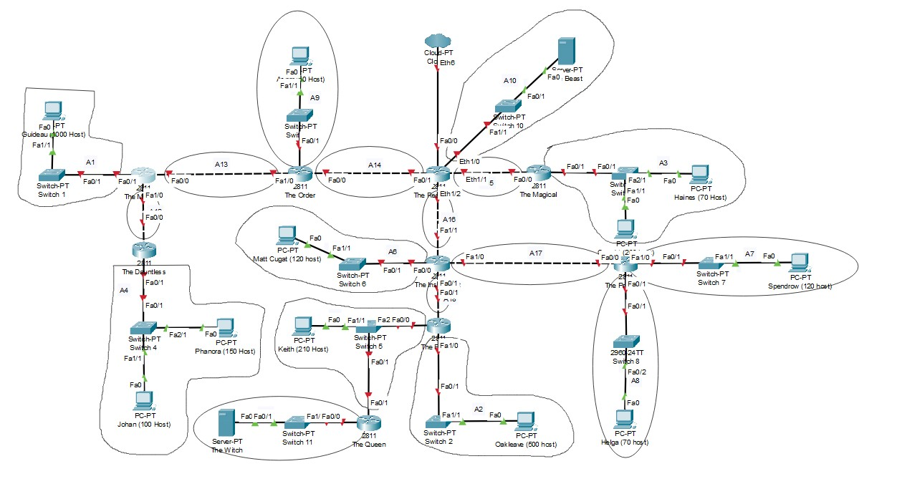
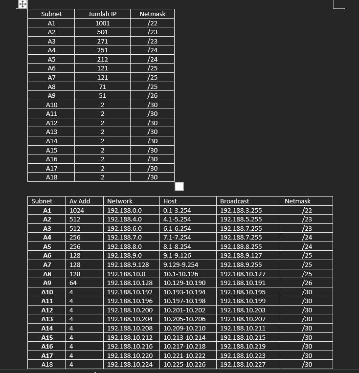
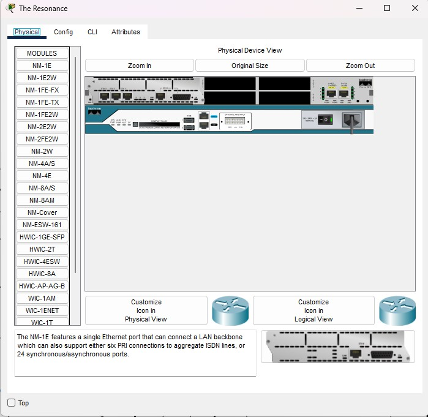
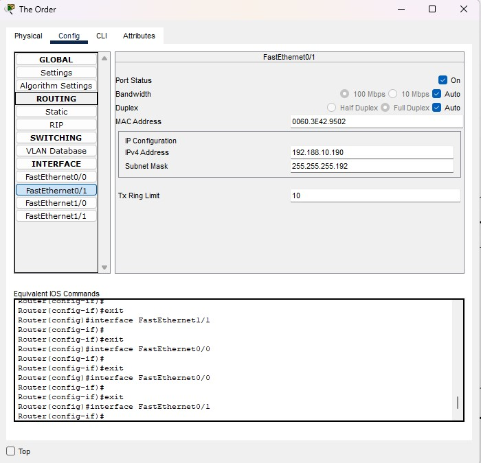
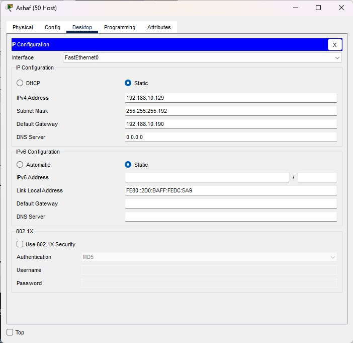

# Jarkom-Modul-4-D07-2022

 Jarkom-Modul-4-D07-2022

## Kelompok D07

| **No** | **Nama**                     | **NRP**    |
| ------ | -----------------------------| ---------- |
| 1      | Reza Maranello Alfiansyah    | 5025201071 |
| 2      | Nuzul Abatony                | 5025201107 |
| 3      | Muhammad Raihan Athallah     | 5025201206 |

IP Prefix Kelompok: `192.188`

# Soal dan Jawaban

- Soal shift dikerjakan pada Cisco Packet Tracer dan GNS3 menggunakan metode perhitungan CLASSLESS yang berbeda. Keterangan: Bila di CPT menggunakan VLSM, maka di GNS3 menggunakan CIDR atau Sebaliknya
- Jika tidak ada pemberitahuan revisi soal dari asisten, berarti semua soal BERSIFAT BENAR dan DAPAT DIKERJAKAN. Untuk di GNS3 CLOUD merupakan NAT1 jangan sampai salah agar bisa terkoneksi internet.
- Pembagian IP menggunakan Prefix IP yang telah ditentukan pada modul pengenalan.
- Pembagian IP dan routing harus SE-EFISIEN MUNGKIN.

Dalam mengerjakan soal ini, kami menggunakan teknik VLSM dengan menggunakan CPT

# VLSM - CPT
## Pembagian Subnet
Hal pertama yang kami lakukan adalah dengan menentukan subnet yang ada pada topologi. Dikarenakan metode yang dipakai adalah VLSM. Kami melingkari tiap host yang terhubung pada interface router dan menghitung IP yang dibutuhkan. Berikut adalah gambaran pembagian subnetnya

## Jumlah dan Pembagian IP
Setelah melakukan pembagian subnet kita melakukan penjumlahan dan pembagian pada IP, sehingga didapatkan hasil penjumlahan ip berikut :

# Config VSLM
## Menambah Ethernet / Port
Karena default hanya memiliki 2 port ethernet, maka kita bisa menambah port pada tab physical

## Config IP pada Node

Contoh pada The Order, kita menambahkan IP dan Subnet Mask sesuai dengan pembagian yang telah dilakukan, dengan IP ditambah 1 dari subnetnya. dan jangan lupa untuk di on kan pada port nya.

Pada server & Client ditambahkan juga gateway yang mengarah ke router terdekat.

Lakukan berulang-ulang pada semua node.
